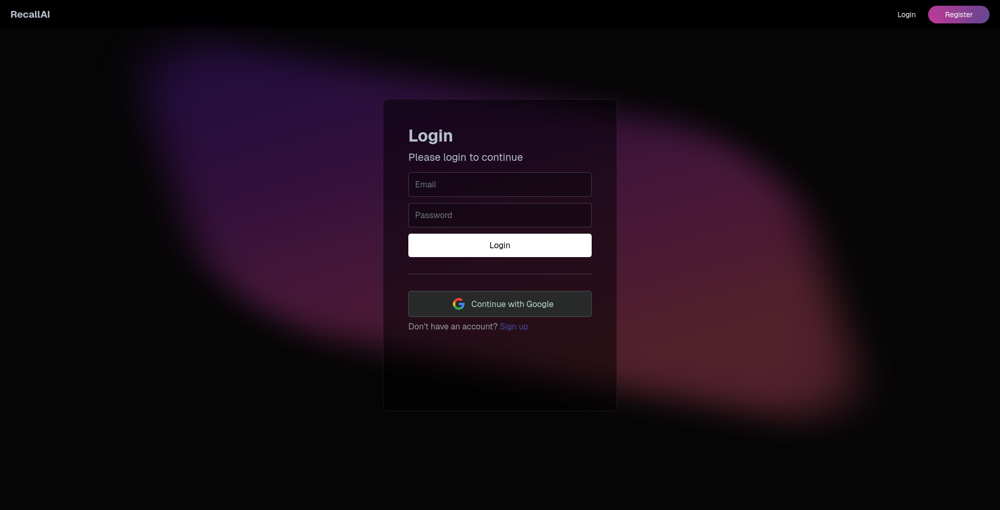

# RecallAI - Study card generator

> Generate study cards with the power of AI

## Features

- [x] Authentication (email/Google)
- [x] Study cards deck generation using OpenAI API
    - [x] Multichoice
    - [x] Question/Answer
    - [x] True/False
- [x] Deck deletion, and editing
- [x] Study time tracking
 

## Screenshots

### Landing page


### Login page



### Dashboard 


### Generate deck form 


### Deck generation result 


### Deck view 


### Deck completed 


## Getting Started

**prerequisites**
- pnpm
- node
- PostgreSQL


0. Clone the repo
```bash
git clone https://github.com/leeviko/RecallAI.git
cd RecallAI
```
1. Create a psql database named `recall`
2. Install all dependencies
```bash
pnpm install
```
3. Setup your env variables
```bash
cp .env.example .env
```
then edit the variables
4. Setup Prisma and generate prisma client
```bash
pnpm prisma migrate dev
pnpm prisma generate
```
5. Start the dev server
```bash
pnpm dev
```


Open [http://localhost:3000](http://localhost:3000) in your browser.

